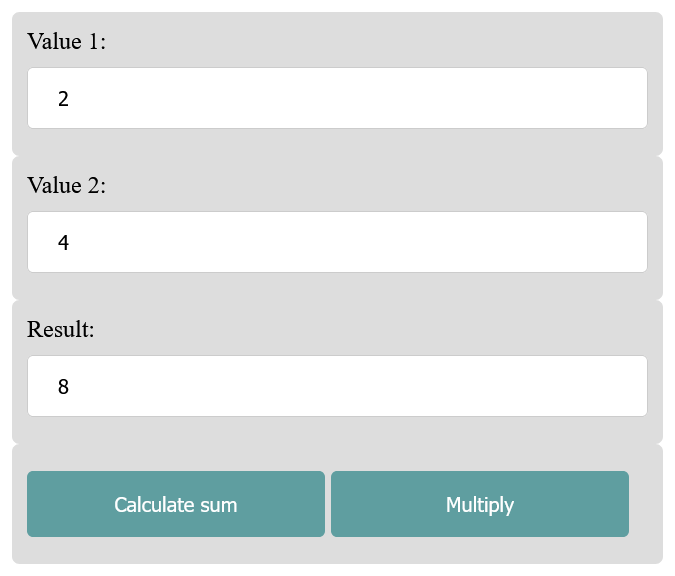

# Arrays_functions_objects_in_JS

 Arrays, functions and objects in JavaScript

---------------------------------------------

## Content
 1. Functions
 2. Arrays
 3. 
 4. 
 5. 
 6. 
 7. 


---------------------------------------------

# 1. Functions in JavaScript
 Functions are subprograms with repeating JavaScript statements that are grouped into a block and called using the function name and optional arguments. Functions in JavaScript are real objects (first-class objects) and variables can be assigned to them. Likewise, functions can be used as parameters or return values of functions.

## There are several ways to create a function in JavaScript:
### Function declaration
 - a function is introduced with the keyword `function`
 - followed by the function name and the pair of parentheses `()`
 - function names are subject to the same restrictions as variable names
 - within the pair of parentheses optionally a list of formal parameters can be noted, several parameters are separated with a comma `,`
 - the code or statement is written between the braces `{}`

 [Complete Code](https://github.com/BellaMrx/Arrays_functions_objects_in_JS/blob/main/Examples/Part_1/script.js) --> **Examples/Part_1/...** 
   ```
    function sum(parameter1, parameter2) {
        // Code for function
        let sum = parameter1 + parameter2;
        return sum;
    }
    let val1 = 200,
        val2 = 100;
    let total = sum(val1, val2); // Call function
    console.log("Result = " + total); // Output: Result = 300
   ```
The function is executed when the function `sum()` is called with the arguments `200`, `100`. Such a function can optionally return a value to the caller with `return` if further work with the value is required. If no value needs to be returned from a function, the `return` statement can be left behind. JavaScript does not require a semicolon at the end of the curly braces of the function block.


### Function expression
A function expression works similarly to the function declaration, except that the function is assigned to a variable, and this reference variable then refers to the function object and can be used. A function expression omits a function name, which makes it an anonymous function.

 [Complete Code](https://github.com/BellaMrx/Arrays_functions_objects_in_JS/blob/main/Examples/Part_2/script.js) --> **Examples/Part_2/...** 
   ```
    let sum = function(parameter1, parameter2) {
        return parameter1 + parameter2;
    }
    let val1 = 100,
        val2 = 200;
    let total = sum(val1, val2); // Call function
    console.log("Result = " + total); // Output: Result = 300
   ```

#### When to use a function declaration or a function expression?
With a function declaration the function must be given a name to be able to call this function with the name. With a function expression a name is optional and can be called via the variable that was assigned to the function.


## Call functions and function parameters 
Parameters are placeholders for current values - which are called arguments. In function `sum(param1, param2)` `param1` and `param2` are parameters, when calling `sum(200, 100)` current values are used as arguments.

If the function has been defined, it can be called via the function name. If a function expects parameters, these are grouped between brackets `()`, individual parameters are separated with a comma `,`. The brackets `()` after a function call must always be set even if the function does not contain any parameters.
   ```
    function sum() {
        // Code for function
    }
    sum();
   ```

When a function is called with fewer or more arguments than parameters were specified in the function declaration. If too few arguments were used in the call, the missing arguments are initialized with the default value `undefined`.
   ```
    function exampleFunc(param1) {
        console.log(param1);    // Output: undefined
    }
    exampleFunc();
   ```
Here the function `exampleFunc()` was called without an argument, therefore the value of the parameter `param1` in the function was initialized with the default value `undefined`. Not necessarily to imitate but that's how you could react to it:
   ```
    function exampleFunc(param1) {
        if (param1 === undefined) {
            console.log("exampleFunc(): No argument!");
        } else {
        console.log(param1);
        }
    }
   ```

Alternatively, you can also continue working with a function if default values are used for omitted arguments. JavaScript knows the principle of default parameters when no corresponding argument has been passed to the function. Thanks to default parameters, functions can be called with none, one or two arguments:

 [Complete Code](https://github.com/BellaMrx/Arrays_functions_objects_in_JS/blob/main/Examples/Part_3/script.js) --> **Examples/Part_3/...** 
   ```
    function userTemplate(fname = "Joe", lname = "Public") {
        let user = {
            userfname: fname,
            userlname: lname
        }
        return user;
    }

    let user1 = userTemplate();
    console.log(user1.userfname);       // Output: Joe
    console.log(user1.userlname);       // Output: Public
    let user2 = userTemplate("Jane");
    console.log(user2.userfname);       // Output: Jane
    console.log(user2.userlname);       // Output: Public
    let user3 = userTemplate("Pepito", "Perez");
    console.log(user3.userfname);       // Output: Pepito 
    console.log(user3.userlname);       // Output: Perez
   ```

If a function is to be called with arguments, it can be accessed with the **arguments object**. The **arguments object** is an array-like object with arguments `arguments[n]`, `n` stands for the number of arguments. The first argument starts with `arguments[0]`. The number of arguments are determined with `arguments.length`.

 [Complete Code](https://github.com/BellaMrx/Arrays_functions_objects_in_JS/blob/main/Examples/Part_4/script.js) --> **Examples/Part_4/...** 
   ```
    function sumAll() {
        let sum = 0;
        if (arguments.length == 0) {        // No arguments were passed?
            return 0;                       // ... then end function with 0
        }
        for (let i = 0; i < arguments.length; i++) {
            sum += arguments[i];
        }
        return sum;
    }
    let total = sumAll(20, 50, 80, 100, 170);
    console.log("Result = " + total);       // Output: Result = 420
   ```
Here all passed values are added using the **arguments object**. In practice, this is now implemented using the **Rest parameter**.

With the rest parameter there is the possibility to use a function with any number of function parameters. The rest parameter is a real array.

 [Complete Code](https://github.com/BellaMrx/Arrays_functions_objects_in_JS/blob/main/Examples/Part_5/script.js) --> **Examples/Part_5/...** 
   ```
    function sumAll(iVal, ...myargs) {
        var sum = iVal;
        myargs.forEach(function(val) {
            sum += val;
        });
        return sum;
    }
    console.log(sumAll(100, 200, 300, 400));    // Output: 1000
   ```
The first parameter with `iVal` is an ordinary parameter with the value 100. The remaining parameters are defined with `_myargs` (200, 300, 400). The remaining parameters are accessed with the `forEach()` method, which calls the function written in `myargs` for each value of the array. The current value is passed to `val` as a parameter in each case. Thus, each value in the `myargs` array is added to the `sum` variable and returned at the end.

It is somewhat clearer with the Arrow function notation:
   ```
    let sumAll = (iVal, ...myargs) => {
        let sum = iVal;
        myargs.forEach((val) => sum +- val);
        return sum;
    }
   ```

## Return value of a function
If a value is to be returned from a function, a `return` statement must be used. The `return` statement specifies the value to be returned. Functions without a `return` statement use a default value which is `undefined` in most cases. After a `return` statement in a function, execution returns to the caller.

 [Complete Code](https://github.com/BellaMrx/Arrays_functions_objects_in_JS/blob/main/Examples/Part_6/script.js) --> **Examples/Part_6/...** 
   ```
    let isDebug = true;

    function debugMessage() {
        if (isDebug) {
            return 'Debug mode is active';
        }
        return 'Debug mode is deactivated';
    }

    var message = debugMessage;     // assign function to variable
    console.log(typeof message);    // function
    var txt = message();            // call debugMessage()
    console.log(txt);               // Output: Debug mode is active
    isDebug = false;
    console.log(message());         // Output: Debug mode is deactivated
   ```
Here, the `debugMessage` function was passed to the `message` variable rather than calling the `debugMessage` function and passing the return value to `message`. With this assignment, a variable `message` was created that points to the function object `debugMessage` and can be called explicitly as a function practically like `debugMessage`.


## The scope of variables in a function
Each function creates a new scope, but not a block scope as it would be the case in other programming languages.
   ```
    let iVal = 222;     // global variable

    function simple(parameter1) {
        if (parameter1) {
            var sVal = 444;
        }
        return sVal + iVal;     // possible because of variables hosting
    }

    let sumUp = simple(true);
    console.log(sumUp);
    console.log(sVal + iVal);   // Error: sVal is unknown
   ```
The variable `iVal` is a global variable and can be used both inside and outside the function. The variable `sVal` can only be used in the function `simple()`. Therefore `console.log(sVal + iVal)`, will result in the error message. This is the scope that JavaScript generates for each function.

However, JavaScript does not create a block scope inside the `if` block here. JavaScript uses variable hosting here:
   ```
    function simple(parameter1) {
        var sVal;
        if (parameter1) {
            sVal = 444;
        }
        return sVal + iVal;
    }
   ```
That a variable is declared inside an `if` block within a function with `var` and is also used outside the `if` block within the function is not always desired and can lead to errors.

For this there is an alternative the keyword `let`, which is used instead of `var`. A `let` variable gets a block scope and is thus only usable in the current code block:
   ```
    function simple(parameter1) {
        if (parameter1) {
            let sVal = 444;     // block scope with let
            console.log(sVal);  // sVal now only valid within the if block
        }
        return sVal + iVal;     // Error : sVal is unknown
    }
   ```
With the keyword `let` it becomes possible to restrict the scope of a variable to individual code blocks.

In JavaScript it is also possible to define functions within functions, so that they are only usable and valid within the function:

 [Complete Code](https://github.com/BellaMrx/Arrays_functions_objects_in_JS/blob/main/Examples/Part_7/script.js) --> **Examples/Part_7/...** 
   ```
    function divide(x, y) {
        return normalize(x) / normalize(y);

        function normalize(val) {
            if (val == 0) {
                return 1;
            }
            return val;
        }
    }
    console.log(divide(4, 0));
   ```

Inside the function `normalize()` is called, which checks if one of the values is 0, and then makes it a 1 if necessary. Calling the function `normalize()` outside the function `divide()` would lead to an error.


## Arrow functions
With arrow functions it is possible to define functions with relatively little effort. Above all, they have the advantage that the `this` keyword within the function refers to the context in which the function was defined. And not, as with a normal function, on the context in which the function is executed.
   ```
    let multiply = val => val * 2;
    console.log(multiply(200));     // Output: 400
   ```

When using multiple parameters:
   ```
    let sum = (param1 + param2) => param1 + param2;
    console.log(sum(200, 400));     // Output: 600   
   ```

The shorter version of the function:
   ```
    let sum = function(param1, param2) {
        return param1 + param2;
    }
   ```

For the arrow function the function body is omitted. This is only possible if the statement of the function consists of only one statement. If there are several statements, the curly brackets `{}` must also be noted:
   ```
    let debug = message => {
    console.log("debug output -> ");
    console.log(message);
    console.log("<- debug output");
    }

    let val = 9876;
    debug("Current value val (" + val + ")");
   ```

As soon as the function consists of several lines, a 'return' statement must be used:
   ```
    let multiply = (param1, param2) => {
        console.log("Multiplication is executed");  
        return param1 + param2;    
    }
    console.log(multiply(4, 20));  
   ```

For a function without parameters, the empty function brackets `()` must be noted:
   ```
    let noPara = () => console.log("Function without parameter"); 
    noPara();
   ```

## Use functions in a website
When a button has been clicked (`click` event), it is intercepted with a so-called event listener (`ducoment.addEventListener()`) and then a corresponding JavaScript function (`calculateSum()` and `calculateMultiply()`). In the function, the corresponding values of the `input` element are read, calculated and passed to the JavaScript function (`showResult`) for output, and the output of the calculation then appears in a text box.

 [Complete Code](https://github.com/BellaMrx/Arrays_functions_objects_in_JS/blob/main/Examples/Part_8) --> **Examples/Part_8/calc.js...** 
   ```
    document.addEventListener('DOMContentLoaded', function() {
        let button1 = document.getElementById('button-calculate-sum');
        button1.addEventListener('click', calculateSum);
        let button2 = document.getElementById('button-calculate-multiply');
        button2.addEventListener('click', calculateMultiply);
    });

    function calculateSum() {
        let x = parseInt(document.getElementById('field1').value);
        let y = parseInt(document.getElementById('field2').value);
        let result = x + y;
        showResult(result);
    }

    function calculateMultiply() {
        let x = parseInt(document.getElementById('field1').value);
        let y = parseInt(document.getElementById('field2').value);
        let result = x * y;
        showResult(result);
    }

    function showResult(result) {
        let resultField = document.getElementById('result');
        resultField.value = result;
        console.log(result);
    }
   ```

 


# 2. Arrays
If several values are to be stored in a variable, this is possible with an array. An array is created by assigning several values to a variable in a square bracket `[]`.
   ```
    let user = ["Ali", "Jane", "Pedro"];
   ```

same without array:
   ```
    let user01 = "Ali";
    let user01 = "Jane";
    let user01 = "Pedro";
   ```

If there are many entries in the array, it is better to list the values one below the other:
   ```
    let user = [
        "Ali", 
        "Jane", 
        "Pedro",
        "Wiktoria",
        "Yui"
    ];
   ```

Arrays can also contain entries with different data types:
   ```
    let user = [
        "John", 
        "Public", 
        32,
        john@email.com,
        true
    ];
   ```

An empty array can also be created:
   ```
    let user = [];      // empty array
   ```

An array can also be created using a constructor function with `new`:
   ```
    let user = new Array();      // empty array
   ```

Arrays can also be attached with a certain size, but this is not really necessary since an array can grow dynamically at runtime:
   ```
    let user = new Array(12);      // 12 undefined elements
   ```

Specifying the length of an array is only possible if the constuctor function of `Array()` is called with a single decimal value as argument:
   ```
    let user = new Array("Ali", "Jane", "Pedro");
   ```

For the arrays with `array()` the keyword `new` can also be omitted. The notation with the square brackets `[]` and without `new` is the array literal notation, and the one with `new` is the constructor notation.


## Access to the individual elements in the array
Access to the individual elements of an array is done with the square brackets and the corresponding index number. The first element in an array always has the index `[0]`, the second element the index `[1]` and so on.

 [Complete Code](https://github.com/BellaMrx/Arrays_functions_objects_in_JS/blob/main/Examples/Part_9/script.js) --> **Examples/Part_9/...** 
   ```
    let user = [
        "Ali",      // [0]      
        "Jane",     // [1]
        "Pedro"     // [2]
    ];

    console.log(user[1]);       // Output: Jane
    let name01 = user[0];       // name01 = "Ali"
    console.log(name01);        // Output: Ali
    user[2] = "Pepito";         // "Pedro" is overwritten
    console.log("user[0] = " + user[0]);    // Output: user[0] = Ali
    console.log("user[1] = " + user[1]);    // Output: user[1] = Jane
    console.log("user[2] = " + user[2]);    // Output: user[2] = Pepito
   ```

This is an example of how to use the `Date` object and the `getDay()` method, with an array (containing all the days of the week), to get the current day of the week:

 [Complete Code](https://github.com/BellaMrx/Arrays_functions_objects_in_JS/blob/main/Examples/Part_10/script.js) --> **Examples/Part_10/...** 
   ```
    let date = new Date();
    let day = datum.getDay();
    let weekday = [
        "Sunday",       // weekday[0]
        "Monday",       // weekday[1]
        "Tuesday",      // weekday[2]
        "Wednesday",    // weekday[3]
        "Thursday",     // weekday[4]
        "Friday",       // weekday[5]
        "Saturday"      // weekday[6]
    ];
    console.log("Today is " + weekday[day]);
   ```


## Multidimensional arrays
An array can also be used inside another array, usually such structures are represented as an object and not as an array:
   ```
    let user = [
        "phoenix420",       // nickname
        24,                 // age
        "ash@phoenix.com",  // e-mail
        false               // admin privileges
    ];
   ```
This is an array for one user and his characteristics. If now several users with the same data are created, this can be realized with multidimensional arrays:

 [Complete Code](https://github.com/BellaMrx/Arrays_functions_objects_in_JS/blob/main/Examples/Part_11/script.js) --> **Examples/Part_11/...** 
   ```
    let user = [
        ["phoenix420",          // [0][0]
            24,                 // [0][1]
            "ash@phoenix.com",  // [0][2]
            false               // [0][3]
        ],
        ["lord777",             // [1][0]
            12,                 // [1][1]
            "cedric@lord.com",  // [1][2]
            false               // [1][3]
        ],
        ["granny",              // [2][0]
            67,                 // [2][1]
            "granny@lord.com",  // [2][2]
            true                // [2][3]
        ]
    ];
    
    console.log(user[1][0]);    // Output: lord777
    console.log(user[1][1]);    // Output: 12
    console.log(user[1][2]);    // Output: cedric@lord.com
    console.log(user[1][3] ? "Admin" : "User"); // Output: User
   ```


## Add or remove new elements from an array
There are several methods for adding and removing elements in arrays. Of course, it is also possible to use the index operator, but this can produce undefined holes in the array.

 [Complete Code](https://github.com/BellaMrx/Arrays_functions_objects_in_JS/blob/main/Examples/Part_12/script.js) --> **Examples/Part_12/...** 
   ```
    let user = [
        "Ali",      // [0]      
        "Jane",     // [1]
        "Pedro"     // [2]
    ];

    user[3] = "Wiktoria";
    user[5] = "Yui";
    user[2] = undefined;    // delete value

    for (let i = 0; i < user.length; i++) {
        console.log(user[i]);
    }
   ```
Here holes were created for the elements `user[2]` and `user[4]`, so the content is `undefined`. It is possible to check this in a loop (`=undefined`) to assign the element to the empty space to close the hole. But in practice it is better not to create holes. Here the `for` loop also used the `length` property, which contains the number of elements in an array.

Arrays can be traversed more comfortably with the **for ... in** and **for... of** loop.

 - for ... in
   ```
    let user = [
        "Ali",      // [0]      
        "Jane",     // [1]
        "Pedro"     // [2]
    ];

    for (let n in user) {
        console.log(user[n]);
    }
   ```

 - for... of
   ```
    let user = [
        "Ali",      // [0]      
        "Jane",     // [1]
        "Pedro"     // [2]
    ];

    for (let n of user) {
        console.log(n);
    }
   ```
The **for... of** loop is a bit more comfortable than the **for ... in** loop. This is because with the **for... of** loop only the property values of the iterable properties can be traversed and thus `user[n]` can be omitted.

### Short overview of common methods for adding or removing elements in the array
| Method       | Description                           |
|------------- | ------------------------------------- |
| `pop()`      | last element in the array is removed |
| `push()`     | a new element is added to the end of the array |
| `shift()`    | removes the first element in the array |
| `unshift()`  | inserts an element at the beginning of the array |
| `slice()`    | extract elements from an array |
| `splice()`   | add, replace or delete element(s) at any position in the array |

 - `pop()`
	- always removes the last element in the array and therefore takes no argument
	- the return value is the last element or `undefined` (if no element is left in the array)

   ```
    let user = ["Ali", "Jane", "Pedro", "Wiktoria", "Yui"]; // array

    let n = user.pop(); // remove last element -> Yui
    console.log(n + " has been removed")
    user.pop(); // remove last element again -> Wiktoria
    console.log(user.length); // Output: 3

    for (let n of user) {
        console.log(n);
    } // Output:  Ali, Jane, Pedro
   ```

 - `push()`
	- adds one or more elements to the end of the array
	- the element to be added is passed as argument
	- the method returns the length of the array

   ```
    let user = []; // empty array

    user.push("Ali");
    user.push("Jane");
    console.log(user.length); // Output: 2
    let size = user.push("Pedro", "Wiktoria", "Yui");
    console.log(size) // Output: 5

    for (let n of user) {
        console.log(n);
    } // Output:  Ali, Jane, Pedro, Wiktoria, Yui
   ```

- `shift()` 
    - removes the first element in the array

   ```
    let user = ["Pedro", "Wiktoria", "Yui", "Jane", "Ali"];

    let n = user.shift(); // remove first element -> Pedro
    console.log(n + " has been removed")
    user.shift(); // remove first element again
    console.log(user.length); // Output: 3

    for (let n of user) {
        console.log(n);
    } // Output:  Yui, Jane, Ali
   ```

- `unshift()`
    - inserts an element at the beginning of the array

   ```
    let user = []; // empty array

    user.unshift("Ali");
    user.unshift("Jane");
    console.log(user.length); // Output: 2
    let size = user.unshift("Pedro", "Wiktoria", "Yui");
    console.log(size) // Output: 5

    for (let n of user) {
        console.log(n);
    } // Output:  Pedro, Wiktoria, Yui, Jane, Ali
   ```

- `slice()`
    - extract elements from an array 

   ```
    let user = ["Ali", "Jane", "Pedro", "Wiktoria", "Yui"];
    console.log(user.slice(2, 4)); // Output: Pedro, Yui
   ```

- `splice()`
    - add, replace or delete element(s) at any position in the array 
    - several arguments are passed to the method =>
	- the first one is the relevant position where the new element will be added, removed or replaced
	- the second argument gives the number of elements to be deleted starting from this position
	- 0 is used when elements are to be inserted
	- the remaining arguments represent the elements that will be added or replaced in the array
    
   ```
    let user = ["Ali", "Jane", "Pedro"];

    user.splice(2, 0, "Yui"); // insert at user[2]

    for (let n of user) {
        console.log(n);
    } // Output: Ali, Jane, Yui, Pedro

    let del = user.splice(1, 2); // [1]&[2] delete
    console.log(del + " have been deleted!");
    user.splice(1, 0, "Wiktoria", "John"); // insert 2 elements
    user.splice(0, 1, "Mohammed") // replace user[0] with Mohammed

    for (let n of user) {
        console.log(n);
    } // Output: Mohammed, Wiktoria, John, Pedro
   ```


## Sort arrays
To sort elements in the array there is the `sort()` method. 

   ```
    const months = ['March', 'Jan', 'Feb', 'Dec'];
    months.sort();
    console.log(months);	// Output: ["Dec", "Feb", "Jan", "March"]
   ```

Here a separate function is written that sets the sort criterion. The comparison function is defined with two parameters, which are called internally in pairs for the values of the array when `sort()` is called. With a corresponding return value of *-1, 1, 0* `sort()` takes care that dsa array is sorted. *-1* if the value is greater than the second value, the opposite happened with *1*. With a return value of *0* both values are equal.

 [Complete Code](https://github.com/BellaMrx/Arrays_functions_objects_in_JS/blob/main/Examples/Part_13/script.js) --> **Examples/Part_13/...**   
   ```
    function compare(val1, val2) {
        if (val1 < val2) {
            return -1; 		// va1 is smaller than val2
        } else if (val1 > val2) {
            return 1; 		// val1 is greater than val2
        } else {
            return 0;	 	// val1 and val2 are equal
        }
    }

    let user = [
        "Jane",
        "Yui",
        "John",
        "Ali",
        "Maya"
    ];

    user.sort(compare);
    for (let n of user) {
	    console.log(n);
    }		// Output: Ali, Jane, John, Maya, Yui
   ```


## Searching in arrays
With `indexOf()` it is possible to search directly in the array for a specific element. The element to be searched is given as argument. It is also possible to use a second argument, from which index the search should be started. If *-1* is returned, then the element is not contained in the array.

 [Complete Code](https://github.com/BellaMrx/Arrays_functions_objects_in_JS/blob/main/Examples/Part_14/script.js) --> **Examples/Part_14/...**   
   ```
    const user = ['Ali', 'Jane', 'Pedro', 'Wiktoria', 'Yui'];

    console.log(user.indexOf('Jane'));      // Output: 1

    // start from index 2
    console.log(user.indexOf('Jane', 2));   // Output: 4

    // element not contained in the array
    console.log(user.indexOf('John'));      // Output: -1
   ```
The `indexOf()` method starts searching at the beginning of the array. With `lastIndexOf()` the search can be started at the end of the array.
The `find()` method returns the value of the element of an array (or `undefined`) that satisfies the condition of a provided test function. The `findIndex()` method returns the index of the first element in the array that satisfies the provided test function, or *-1*.


### More methods for arrays

| Method        | Description                                 |
|-------------- | ------------------------------------------- |
| `concat()`    | appends elements or arrays to another array |
| `copyWithin()`| Copy elements within the array              |
| `filter()`    | Elements can be sorted out from the array according to a certain filter condition  |
| `join()`      | converts an array into a string             |
| `reverse()`   | sorts the elements in the array into the reverse order |
| `splice()`, `toLocaleString()`, `valueOf`    | arrays can be converted into strings |

 [More methods](https://developer.mozilla.org/en-US/docs/Web/JavaScript/Reference/Global_Objects/Array)